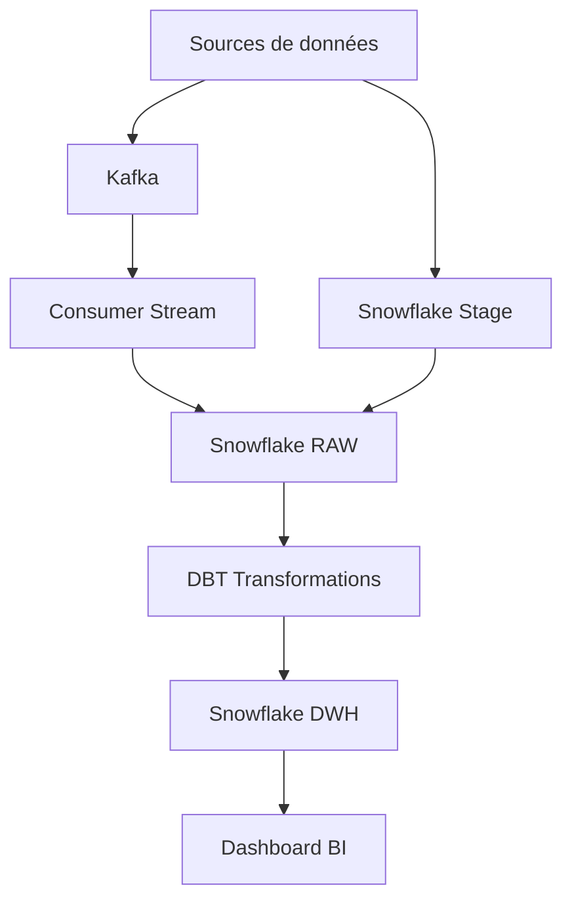

# 🚀 E-commerce Real-Time Analytics Pipeline


Un pipeline de données moderne pour analyser les ventes e-commerce en temps réel, construit avec Kafka, Snowflake, et DBT.

## 📋 Table des matières

- [Vue d'ensemble](#vue-densemble)
- [Architecture](#architecture)
- [Prérequis](#prérequis)
- [Installation](#installation)
- [Configuration](#configuration)
- [Utilisation](#utilisation)
- [Structure du projet](#structure-du-projet)
- [Développement](#développement)
- [Monitoring](#monitoring)
- [Contribution](#contribution)
- [Licence](#licence)

## 🎯 Vue d'ensemble

Ce projet implémente un pipeline de données complet pour analyser les ventes e-commerce en temps quasi-réel. Il combine :
- Ingestion de données en temps réel avec Kafka
- Stockage et traitement dans Snowflake
- Transformations et modélisation avec DBT
- Visualisation via des dashboards BI

### Fonctionnalités principales
- ⚡ Streaming temps réel des événements de vente
- 📊 Modélisation dimensionnelle (Star Schema)
- 🔄 Transformations automatisées avec DBT
- 📈 Dashboards de monitoring en temps réel
- 🔍 Analyses avancées des performances de vente

## 🏗 Architecture



### Components principaux
- **Sources de données**
  - Événements e-commerce en temps réel
  - Données historiques (Kaggle datasets)
  - APIs externes (taux de change, météo)
  
- **Pipeline d'ingestion**
  - Kafka pour le streaming temps réel
  - Batch imports pour les données historiques
  
- **Data Warehouse**
  - Snowflake comme stockage principal
  - Modèle en étoile optimisé
  
- **Transformations**
  - DBT pour l'orchestration des transformations
  - Tests de qualité automatisés
  - Documentation auto-générée

## ⚙️ Prérequis

- Docker et Docker Compose
- Python 3.9+
- Compte Snowflake
- Compte DBT Cloud (optionnel)
- Un outil BI (Metabase, Tableau, etc.)

## 🛠 Installation

1. **Cloner le repo**
```bash
git clone https://github.com/username/ecommerce-analytics
cd ecommerce-analytics
```

2. **Créer l'environnement virtuel**
```bash
python -m venv venv
source venv/bin/activate  # Linux/Mac
.\venv\Scripts\activate   # Windows
```

3. **Installer les dépendances**
```bash
pip install -r requirements.txt
```

4. **Lancer l'infrastructure**
```bash
docker-compose up -d
```

## ⚡ Configuration

1. **Variables d'environnement**
Créer un fichier `.env` à la racine :
```env
# Kafka
KAFKA_BOOTSTRAP_SERVERS=localhost:9092

# Snowflake
SNOWFLAKE_ACCOUNT=your_account
SNOWFLAKE_USER=your_user
SNOWFLAKE_PASSWORD=your_password
SNOWFLAKE_WAREHOUSE=your_warehouse
SNOWFLAKE_DATABASE=your_database

# API Keys
EXCHANGE_RATE_API_KEY=your_key
```

2. **Configuration DBT**
Modifier `profiles.yml` :
```yaml
ecommerce:
  target: dev
  outputs:
    dev:
      type: snowflake
      account: "{{ env_var('SNOWFLAKE_ACCOUNT') }}"
      user: "{{ env_var('SNOWFLAKE_USER') }}"
      password: "{{ env_var('SNOWFLAKE_PASSWORD') }}"
      warehouse: "{{ env_var('SNOWFLAKE_WAREHOUSE') }}"
      database: "{{ env_var('SNOWFLAKE_DATABASE') }}"
```

## 🚀 Utilisation

1. **Démarrer le producteur Kafka**
```bash
python src/producers/order_producer.py
```

2. **Lancer le consumer**
```bash
python src/consumers/snowflake_consumer.py
```

3. **Exécuter les transformations DBT**
```bash
cd dbt
dbt deps
dbt run
dbt test
```

4. **Accéder aux dashboards**
- Ouvrir votre outil BI
- Connecter à Snowflake avec les credentials fournis
- Importer les dashboards depuis `dashboards/`

## 📁 Structure du projet

```
ecommerce-analytics/
├── src/
│   ├── producers/          # Kafka producers
│   ├── consumers/          # Kafka consumers
│   └── utils/              # Utilitaires communs
├── dbt/
│   ├── models/
│   │   ├── staging/       # Tables de staging
│   │   ├── intermediate/  # Tables intermédiaires
│   │   └── marts/        # Tables finales
│   ├── tests/            # Tests personnalisés
│   └── macros/           # Macros DBT
├── docker/
│   └── docker-compose.yml
├── dashboards/           # Templates BI
├── docs/                 # Documentation
└── tests/               # Tests unitaires
```

## 🔧 Développement

### Tests
```bash
# Tests unitaires
pytest tests/

# Tests DBT
cd dbt
dbt test

# Linting
black src/
flake8 src/
```

### CI/CD
Le projet utilise GitHub Actions pour :
- Exécuter les tests automatiquement
- Vérifier le style du code
- Déployer DBT en production
- Générer la documentation

## 📊 Monitoring

- **Métriques Kafka** : Prometheus + Grafana
- **Logs** : ELK Stack
- **Alerting** : Configuration dans `monitoring/alerts.yml`

## 🤝 Contribution

1. Fork le projet
2. Créer une nouvelle branche (`git checkout -b feature/amazing-feature`)
3. Commit les changements (`git commit -m 'Add amazing feature'`)
4. Push la branche (`git push origin feature/amazing-feature`)
5. Ouvrir une Pull Request

## 📝 Licence

Ce projet est sous licence MIT - voir le fichier [LICENSE](LICENSE) pour plus de détails.

---

## 🙋‍♂️ Support

Pour toute question ou problème :
- 📧 Ouvrir une issue
- 💬 Contacter l'équipe Data
- 📚 Consulter la [documentation complète](docs/)